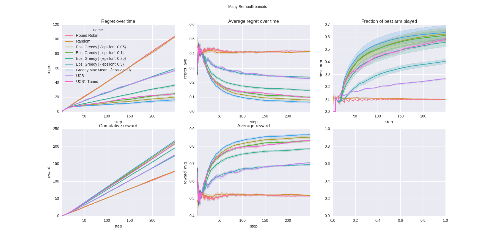
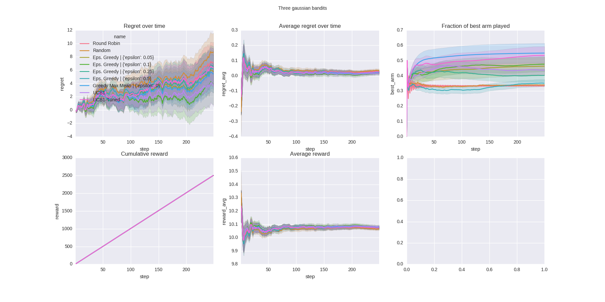
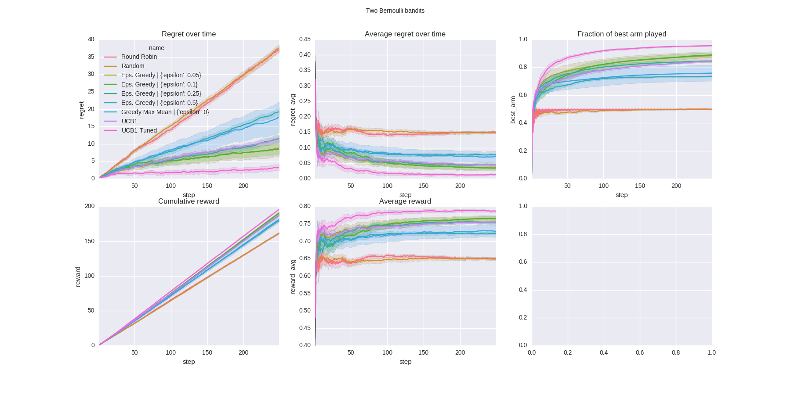
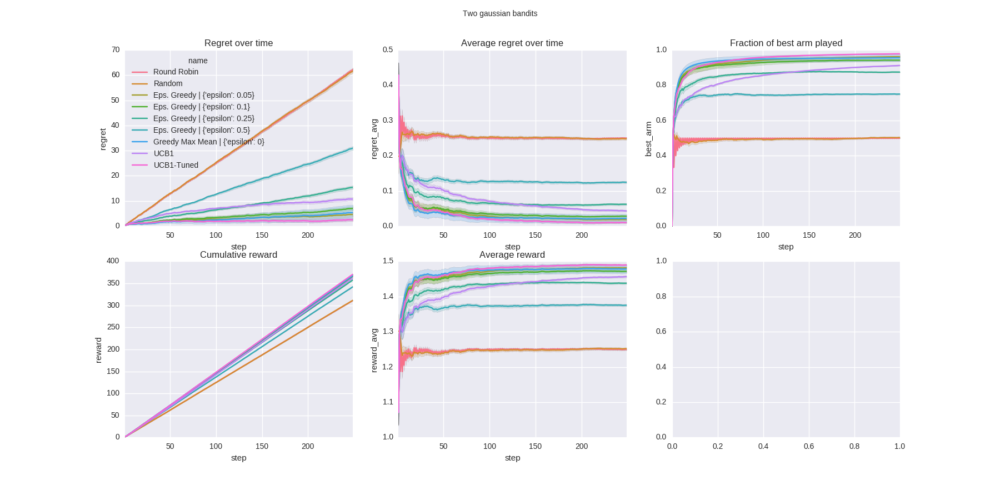
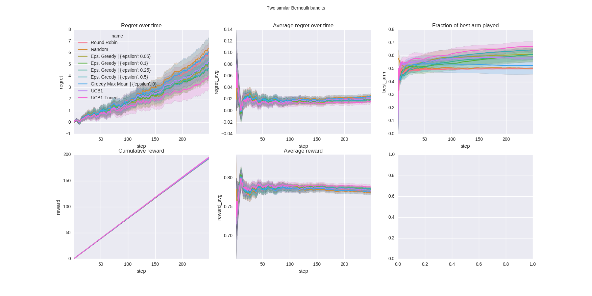

===============================
pandits - python bandits
===============================

`pandits` is a multi-armed *bandit* implementation in *python*.
Therefore, and because I like puns, it's called `pandit`.

I played around with bandits some time ago and this was part of the code.
Maybe you think it's interesting, maybe not.

For a proper intro to bandits see:

- https://ipvs.informatik.uni-stuttgart.de/mlr/marc/teaching/14-BanditsOptimizationActiveLearningBayesianRL.pdf
- https://homes.di.unimi.it/~cesabian/Pubblicazioni/ml-02.pdf

Getting Started
---------------

Have a look at the jupyter notebook `Experiments.ipynb`.

::

    virtualenv -p python3 .venv
    source .venv/bin/activate

    pip install -r requirements_dev.txt

    jupyter notebook

Pics
-------

Credits
---------

This package was created with Cookiecutter_ and the `audreyr/cookiecutter-pypackage`_ project template.

.. _Cookiecutter: https://github.com/audreyr/cookiecutter
.. _`audreyr/cookiecutter-pypackage`: https://github.com/audreyr/cookiecutter-pypackage

